# **TP VPN** 
## **OpenVPN**   VS      **Wireguard** 
#
## M1 Computer & Network Systems

               Nom: KOKPATA Eudes 
        Enseignant: Mehdi DENOU

                    2025-2026

#
## Table des matières

  [Introduction](#introduction)
  [Architecture](#arch1)
  [Partie 1 : Préparation de l'architecture et Routage](#partie-1)
  [1.1 Configuration des machines](#1.1-config-mach)
  [1.2 Explication du routage:](#1.2--routage)
  [1.3	Test des pings](#1.3-test-pings)
  [Partie 2 : Mise en place d'OpenVPN](#Partie-2)
  [2.1	Configuration VPN](#2.1-config-vpn)
  [Partie 3 : Étude du routage global](#Partie-3)
 [3.1 Configuration du VPN pour tous les paquets sortant du C1](#3.1-config-vpn-c1)
 [3.2	Explication du Table de routage C1](#3.2-table-routage-c1)
 [Partie 4 : L'infrastructure DNS](#Partie-4)
 [4.1	Étape 1 : S3 en serveur DNS Cache (Bind9)](#Étape-1)
[4.2	Étape 2 : Le Serveur DNS Interne (sur S5)](#Étape-2)
[Étape 3 : Test de ssh de C1](#Étape-3)
[Configuration finale du serveur VPN (S4)](#config-final-s4)
[Test de résilience (Coupure de l'interface physique)](#test-de-résilience)
[WireGuard](#wireguard)
[Architecture](#architecture-1)
[Q1](#q1.)
[Configuration des machines](#config-machines)
[Test de ping VPN](#test-de-ping-vpn:)
[Q2](#q2)
[Redirection du trafic (AllowedIPs \= 0.0.0.0/0)](#Redirection)
[Q3](#q3)
[Rétablissement du tunnel (Stateless vs Stateful)](#rétablissement)
[Q4](#q4.)
[Q5](#q5)
[Comparaison des  fichiers de configurations finaux  des serveurs](#Comparaison-serveur)
[Conclusion](#conclusion)
[Ressources](#ressources)

# 
# **Introduction**

**Au cœur des Tunnels Sécurisés**

Imaginez que vous deviez envoyer un document ultra-secret à un collègue de l'autre côté du pays, mais que la seule route disponible soit publique, bondée et surveillée de toutes parts (Internet). Comment faire pour que personne ne lise votre message en chemin ? La solution est de construire un tunnel blindé, invisible et privé, directement entre vous et votre collègue.

C'est exactement le rôle d'un **VPN** (*Virtual Private Network*).

Dans ce TP, nous allons plonger dans les coulisses de la sécurité réseau en construisant et en connectant notre propre infrastructure. Pour cela, nous allons mettre en place et confronter deux technologies incontournables :

* **OpenVPN (Le Vétéran) :** C'est le standard de l'industrie depuis des années. Ultra-robuste et capable de s'adapter à toutes les situations, il est puissant mais demande une configuration minutieuse (gestion de multiples certificats et clés de sécurité).  
* **WireGuard (Le Challenger) :** C'est la nouvelle révolution des réseaux. Pensé pour être minimaliste, furtif et incroyablement rapide, il se configure en quelques lignes seulement, balayant la complexité des anciens systèmes.

**L'objectif de cette étude est double :** déployer ces deux solutions de bout en bout pour connecter des réseaux distants, et observer par la pratique le "choc des générations". Nous verrons comment le monde des réseaux évolue d'une architecture lourde et complexe (OpenVPN) vers une simplicité absolue et redoutablement efficace (WireGuard).
#

# **Architecture**{#arch1}
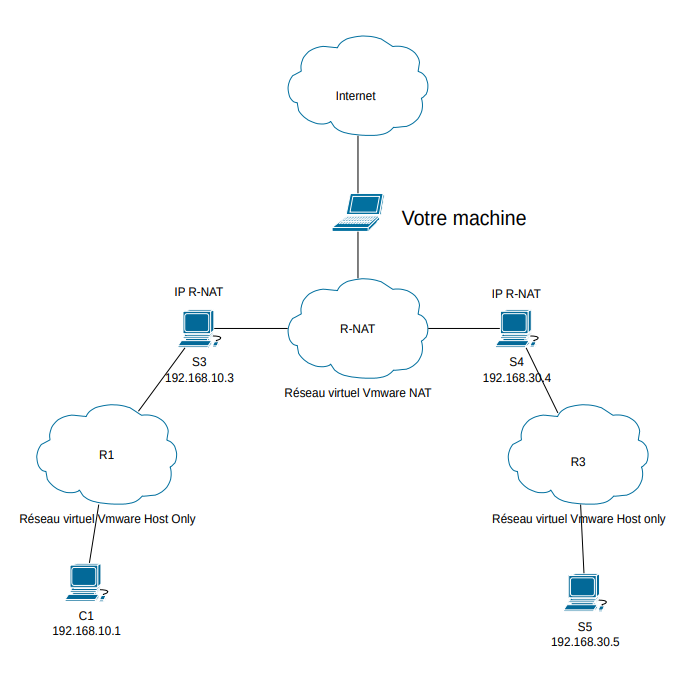

Dans ce TP les machines utilisées sont des machines virtuelles Debian 12 sous VMWare.
#

# **Partie 1 : Préparation de l'architecture et Routage** {#partie-1}

## **1.1	Configuration des machines** {#1.1-config-mach}

**C1**  
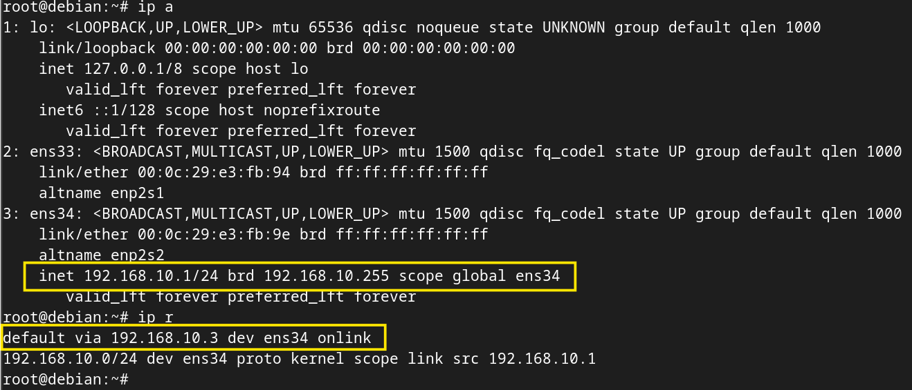

**S3**  
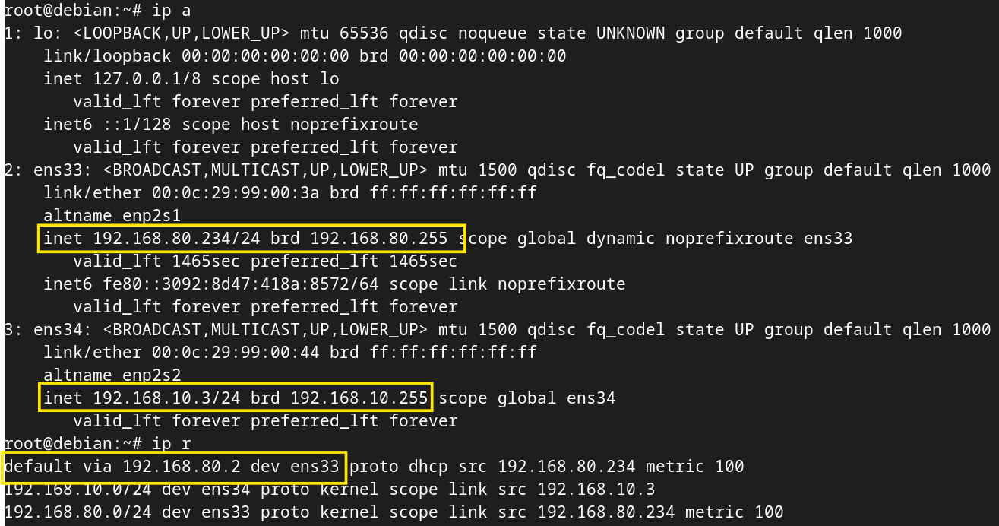
Activation du routage :  ***sudo sysctl \-w net.ipv4.ip\_forward=1***

**S4**  
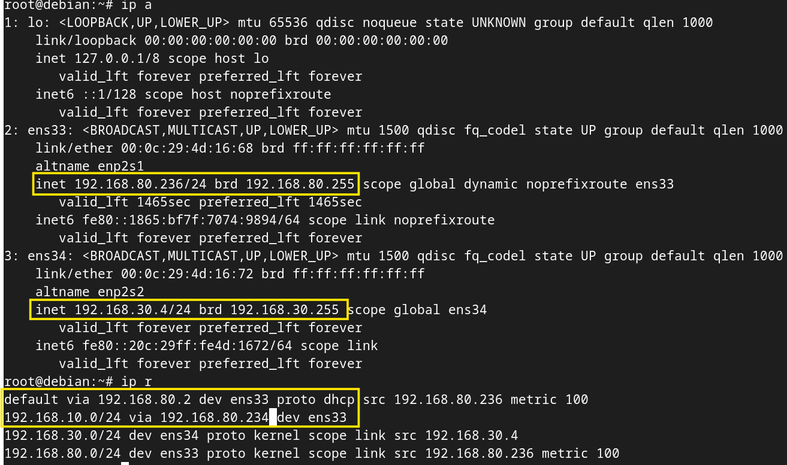
Activation du routage: ***sudo sysctl \-w net.ipv4.ip\_forward=1***

**S5**  
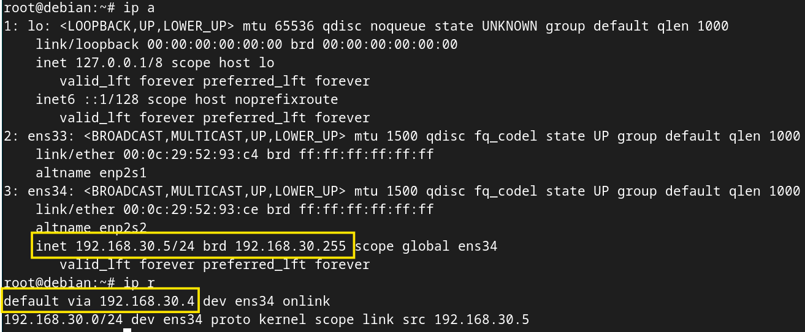

## **1.2	Explication du routage:** {#1.2-routage}

* **S3 (192.168.10.3) :** Aucune route statique n'a été ajoutée. Sa route par défaut pointe vers la passerelle NAT de VMware pour avoir accès à Internet.  
    
* **S4 (192.168.30.4) :** Sa route par défaut pointe également vers la passerelle NAT de VMware pour accéder à Internet. Et une route statique vers le réseau C1. Cela permettra d’indiquer à S4 que pour joindre le réseau de C1 (192.168.10.0/24), il doit passer par l'interface de S3 qui est connectée au réseau R-NAT, validant ainsi le ping S4/R-NAT depuis C1.  
    
* **C1 (192.168.10.1):** Sa route par défaut est S3 (192.168.10.3). Cela permet de valider le ping S4 depuis C1 sans avoir à créer de route statique sur S3 (S3 forwardera naturellement les requêtes de C1 vers le réseau R-NAT).  
    
* **S5 (192.168.30.5) :** S5 est un serveur interne. Sa passerelle par défaut est S4 (192.168.30.4). Le ping de C1 vers S5 échoue car le réseau R-NAT (entre S3 et S4) ne connaît pas la route de retour vers le réseau R1 (192.168.10.0), et les paquets sont droppés.  
* **Activation du routage des paquets sur S3 et S4**
  
## **1.3	Test des pings** {#1.3-test-pings}

* ***ping S3/R1 depuis C1 est OK*** 
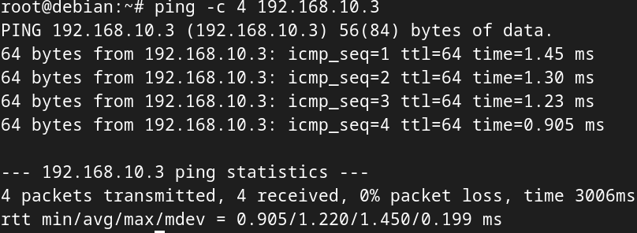

* ***ping S4/R-NAT depuis S3 est OK***
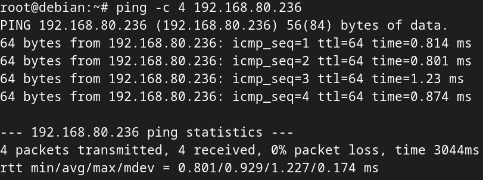

* ***ping S4/R-NAT depuis C1 est 0K***
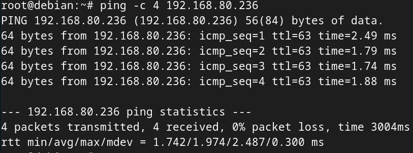

* ***ping 194.199.90.1 depuis S3 et S4 sont OK***

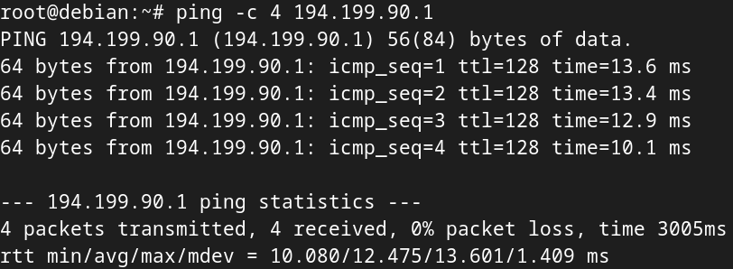

* ***ping S5 depuis S4 est OK***

*  ***ping S5 depuis C1 n'est pas OK (c'est normal et voulu)*** 
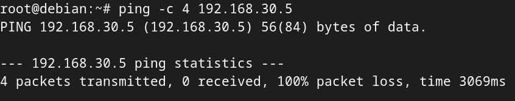

# 

# **Partie 2 : Mise en place d'OpenVPN**{#Partie-2} 

Dans cette partie les fichiers de configuration PKI ***(ca.crt, openVPN.crt, openVPN.key, dh.pem, ta.key***) d’OpenVPN ont été fournit donc on a pas besoin de générer de nouveau le certificat et le couple de clé privé et public:
**Explication des fichier PKI d’OpenVPN:**

* **ca.crt (Certificat de l'Autorité de Certification) :**  
  * **Le rôle :** C'est le "juge de confiance". Il est installé sur le serveur et tous les clients. Il permet à chacun de vérifier que l'interlocuteur en face utilise bien un certificat légitime, signé par l'entreprise, et non un faux.  
* **openVPN.crt (Certificat Public du serveur/client) :**  
  * **Le rôle :** C'est la "carte d'identité publique". Le serveur (ou le client) l'envoie à l'autre partie pour prouver son identité. Il contient une clé publique qui permet de chiffrer des données que seul le propriétaire de la carte pourra lire.  
* **openVPN.key (Clé Privée) :**  
  * **Le rôle :** C'est le “secret absolu". Ce fichier ne doit **jamais** quitter la machine à laquelle il appartient. Il permet à la machine de déchiffrer les messages qui lui sont adressés et de prouver de manière irréfutable que c'est bien elle qui a envoyé le certificat.  
* **dh.pem (Paramètres Diffie-Hellman) :**  
  * **Le rôle :** C'est le "générateur de code secret". Il est utilisé uniquement par le serveur. Il fournit la base mathématique qui permet au client et au serveur de se mettre d'accord sur une clé de session temporaire de manière totalement sécurisée, même si quelqu'un espionne le réseau au moment de leur connexion (Perfect Forward Secrecy).  
* **ta.key (Clé TLS-Auth / HMAC )**  
  * **Le rôle :** C'est le "videur à la porte". C'est une clé secrète identique partagée entre le client et le serveur (HMAC). Si le serveur reçoit une requête de connexion qui ne possède pas la signature mathématique de cette clé, il jette le paquet à la poubelle sans même essayer de le lire. Cela rend votre VPN invisible aux scanners de ports et le protège contre les attaques de type déni de service (DDoS).

## **2.1	configuration VPN** {#2.1-config-vpn}
* modification du fichier ***/etc/openvpn/server.conf***  sur S4**
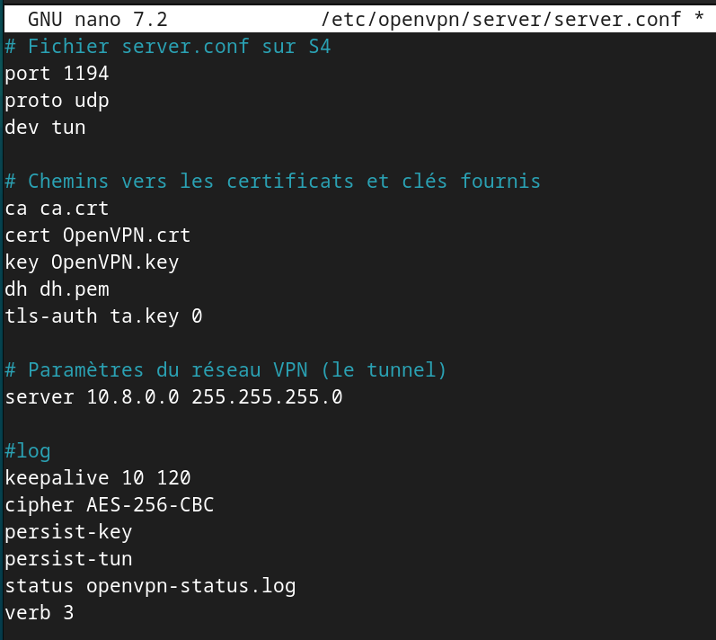 

* On Démarre le service côté serveur :  
  * ***sudo systemctl start openvpn-server@server***

**C1**  
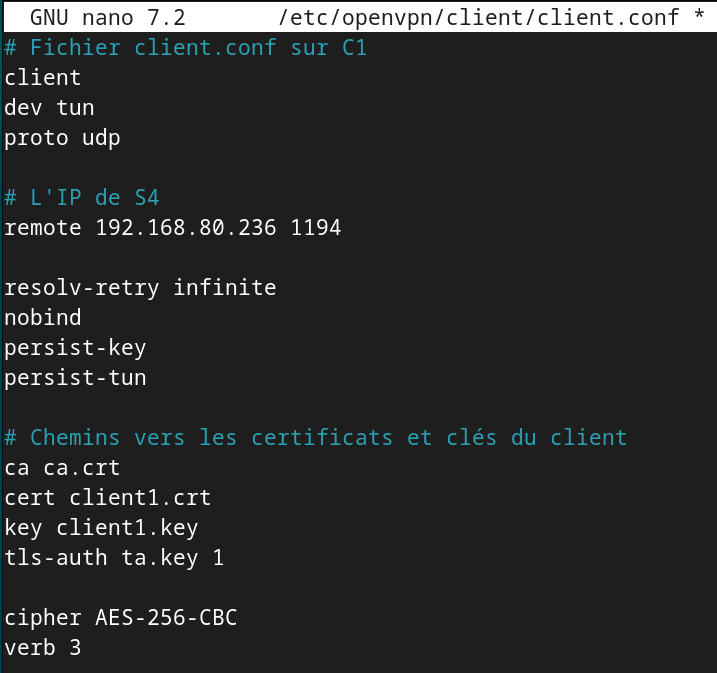

* Démarrez le client :   
  * ***sudo openvpn \--config /etc/openvpn/client/client.conf***

* IP S4 sur le VPN : ***10.8.0.1***   
* IP C1 sur le VPN : ***10.8.0.6***
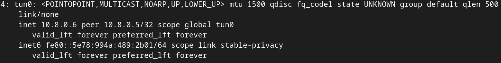
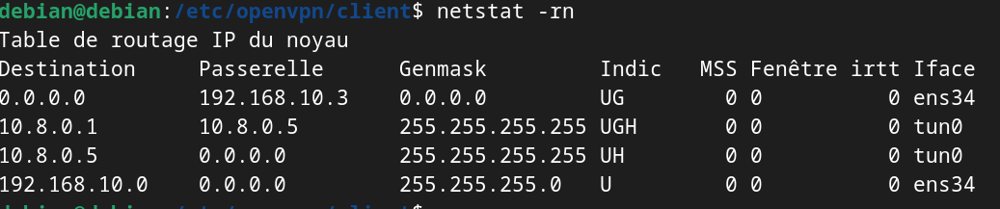
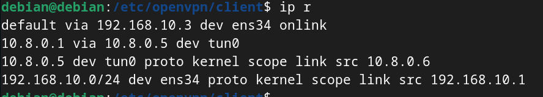

* ***ping 192.168.30.5 (S5)***
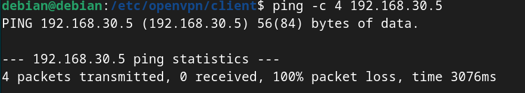
* **Explication de l'échec du ping 192.168.30.5 depuis C1 :**
  * Actuellement, C1 ne connaît pas la route pour joindre 192.168.30.0/24 via le VPN
  
* **Correction pour faire passer le SSH et le Ping par le VPN:**  
  * En ligne de commande: Sur C1, on ajoute une route static:   
    * ***ip route add 192.168.30.0/24 via 10.8.0.5***
    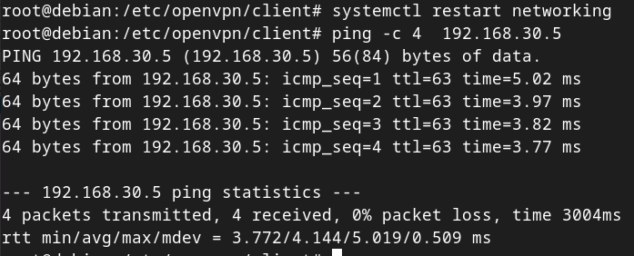
    * Validant ainsi le ping et le ssh de C1 vers le S5 passant par le tunnel
  
***Interface tun0 sur C1 \=\> requet ICMP en clair sur le l’interface virtuel d’OpenVPN***
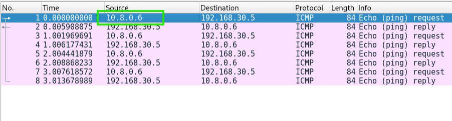

Même la connexion ssh passe par le tunnel.
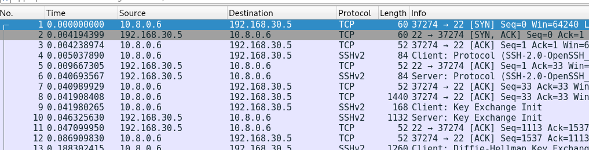

***interface physique ens33 sur C1 \=\> les paquets icmp sont*** **encapsulés  par le OpenVPN** 

***Interface R3 sur S4 \=\> S5 ne connaît pas l’ip de C1, connaît uniquement l’ip du VPN qu’il utilise***

Pour éviter de configurer manuellement la route statique sur C1 à chaque nouvelle connexion, nous allons l'intégrer au serveur VPN. Ainsi, le serveur indique automatiquement au client que pour joindre S5, il doit utiliser la passerelle du tunnel (10.8.0.5). 

* Modification du fichier ***server.conf*** (sur S4): on ajoute la ligne   
  * ***push "route 192.168.30.0 255.255.255.0"***  
  * Cette commande permet de d’envoyer les informations du routage au client dès qu’il se connecte. Le serveur lui envoie cet ordre de routage. C1 ajoute alors lui-même la route dans sa table de routage sans qu' on ait  à taper de commande ip route manuellement.  
 
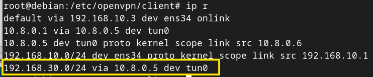

# 

# **Partie 3 : Étude du routage global**{#Partie-3}

## **3.1	Configuration du VPN pour tous les paquet sortant du C1** {#3.1-config-vpn-c1}

* Tous les paquets sortant de C1 (y compris vers Internet) devront être encapsulés et envoyés vers S4. S4 devra agir comme routeur NAT pour ce trafic virtuel vers Internet afin de garantir le chemin de retour, sinon les serveurs web sur Internet ne sauront pas comment répondre à l'IP privée du VPN 10.8.0.1
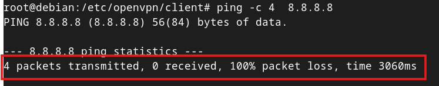
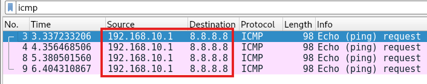
On voit que le ping ne passe pas, sans traduction d'adresse ip au niveau du S4 et utilise l’interface physique de C1 sans passer par le tunnel VPN.

* Dans le fichier ***server.conf*** sur S4, on ajoute la directive:  
  * ***push "redirect-gateway def1" (0.0.0.0/0)***: à pour but de forcer tout le trafic sortant de C1 (y compris sa navigation Web vers Internet) à entrer dans le tunnel VPN ***tun0***  
* Ajout du NAT (Masquerade) sur l'interface de S4 connectée au réseau R-NAT permet de remplacer l'adresse privée de C1 par l'adresse "publique" (ou du moins, celle connectée à la passerelle Internet) de S4:   
  * dans le fichier ***/etc/nfatables.conf*** on ajoute les lignes suivantes:  
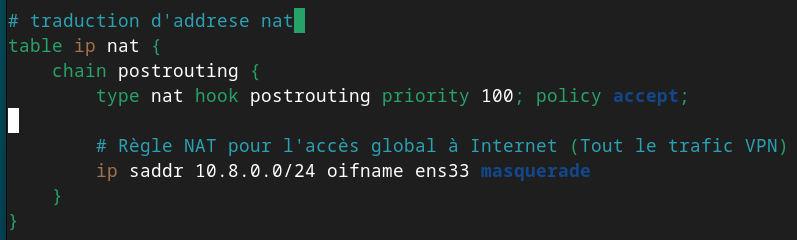
  
* On voit ainsi que le ping vers google passe bien par le server VPN (***10.8.0.6***)
  
## **3.2	Explication du Table de routage C1** {#3.2-table-routage-c1}
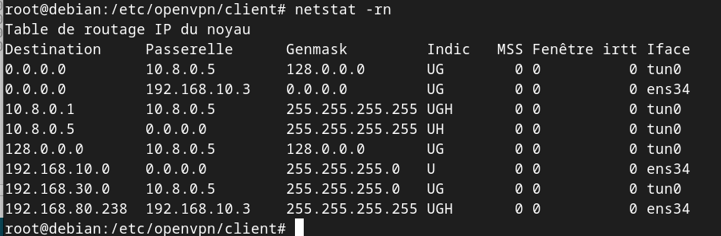
**1\. Le détournement du trafic global (Les deux routes /1)**

* 0.0.0.0 (Genmask 128.0.0.0) vers passerelle 10.8.0.5 (Interface tun0)  
* 128.0.0.0 (Genmask 128.0.0.0) vers passerelle 10.8.0.5 (Interface tun0)  
  * **Explication :** C'est le cœur de l'astuce def1. Au lieu d'effacer la route par défaut existante, OpenVPN crée deux nouvelles routes très larges qui englobent l'intégralité des adresses IPv4 existantes (la première couvre les adresses de 0 à 127, et la seconde de 128 à 255). Comme leur masque réseau (128.0.0.0, soit un sous-réseau /1) est plus précis que la route par défaut standard (0.0.0.0 en /0), elles deviennent prioritaires. Tout le trafic vers Internet est donc "aspiré" vers le tunnel VPN (tun0).

**2\. L'exception vitale (La route d'hôte vers le serveur VPN)**

* 192.168.80.238 (Genmask 255.255.255.255) vers passerelle 192.168.10.3 (Interface ens34)  
  * **Explication :** C'est une route d'hôte (le masque .255 indique une machine unique). L'IP 192.168.80.238 correspond à l'adresse "publique" de ton serveur VPN (S4 sur le réseau R-NAT). OpenVPN ajoute automatiquement cette route pour obliger les paquets *chiffrés* du tunnel à utiliser l'ancienne passerelle physique (S3). Sans cette exception, le tunnel VPN essaierait de s'envoyer lui-même dans le VPN, créant une boucle de routage infinie et coupant la connexion \!

**3\. L'ancienne route par défaut (La route de secours)**
* 0.0.0.0 (Genmask 0.0.0.0) vers passerelle 192.168.10.3 (Interface ens34)  
  * **Explication :** C'est la route par défaut d'origine de ta machine C1, qui pointe vers le routeur S3. Elle n'a pas été supprimée, mais elle est ignorée par le système à cause des deux routes plus précises du VPN vues en point 1\. Si on coupe le VPN, les deux routes en /1 disparaissent, et cette route redevient active instantanément.

**4\. Les routes du réseau d'entreprise (Chemin Aller)**

* 192.168.30.0 (Genmask 255.255.255.0) vers passerelle 10.8.0.5 (Interface tun0)  
  * **Explication :** C'est la route qui a été poussée précédemment par le serveur pour permettre d'atteindre le réseau interne R3 (où se trouve le serveur S5).

**5\. Les routes du réseau local physique**

* 192.168.10.0 (Genmask 255.255.255.0) vers 0.0.0.0 (Interface ens34)  
  * **Explication :** C'est la route qui indique que C1 est physiquement connecté au réseau R1. Le trafic destiné à d'autres machines sur ce même câble (comme 192.168.10.3) ne passe pas par le routeur, d'où la passerelle 0.0.0.0.

**6\. Les routes de la topologie VPN (net30)**

* 10.8.0.5 (Genmask 255.255.255.255) vers 0.0.0.0 (Interface tun0)  
* 10.8.0.1 (Genmask 255.255.255.255) vers passerelle 10.8.0.5 (Interface tun0)  
  * **Explication :** Ces routes sont liées à l'architecture net30 d'OpenVPN. Elles indiquent comment joindre l'adresse du serveur VPN 10.8.0.1 en passant par le "peer" (le bout du tuyau) virtuel qui t'a été assigné, 10.8.0.5
  
#
# **Partie 4 : L'infrastructure DNS** {#Partie-4}
## **4.1	Étape 1 : S3 en serveur DNS Cache (Bind9)**{#Étape-1}
L'objectif ici est que S3 interroge Internet pour résoudre les noms publics (comme www.univ-evry.fr ) et garde les réponses en mémoire.

**Sur S3 :**
1. Installation du serveur DNS Bind9 : ***sudo apt install bind9 bind9utils bind9-doc***  
2. Configuration des options globales pour autoriser les requêtes de C1 et faire office de cache. Édite ***/etc/bind/named.conf.options*** :
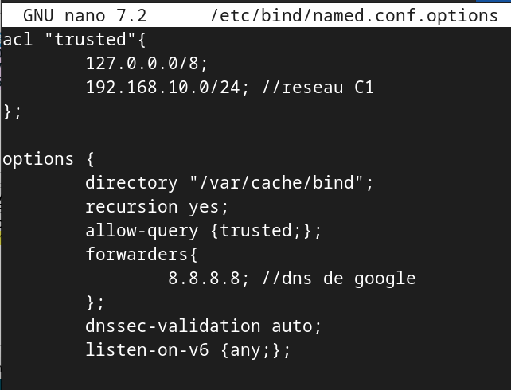
3. Redémarre le service : ***sudo systemctl restart bind9.***  
4. **Sur C1 (Test) :** Modifie ***/etc/resolv.conf*** pour qu'il utilise S3 :   
   1. ***nameserver 192.168.10.3.***   
   2. Test de la résolution : ***ping www.univ-evry.fr***
   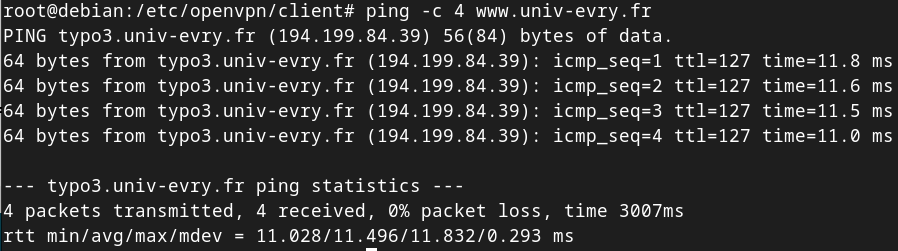
   3. Récupération de l’IP: ***dig [www.univ-evry.fr](http://www.univ-evry.fr)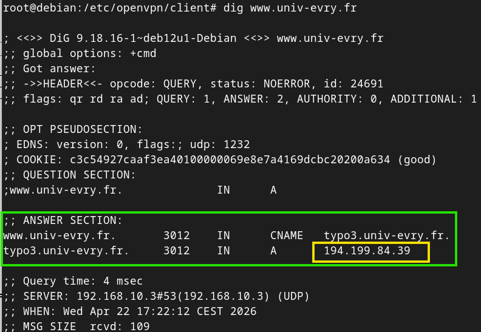***

## **4.2	Étape 2 : Le Serveur DNS Interne (sur S5)**{#Étape-2}

Pour que S4 puisse répondre aux requêtes du S5, sans ajouter une route statique sur S3. Nous sommes obligés d’ajouter une règle nat sur S4 afin de masquer l’ip de S5: ***ip saddr 192.168.30.0/24 oifname ens33 masquerade:*** Cette règle permet à  S4 remplace l'IP source 192.168.30.5 par sa propre IP 192.168.80.238.   
S3 reçoit une requête venant de 192.168.80.238 (qu'il sache comment joindre puisqu'ils sont sur le même réseau R-NAT) et pourra répondre.

**Sur S5 :**
1. Installation Bind9 : ***sudo apt install bind9.***  
2. On configure les options (***/etc/bind/named.conf.options***) pour qu'il utilise S3 comme redirecteur (cela permet aux machines internes d'aller sur Internet si besoin  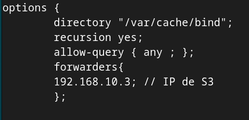 )
3. Déclare la zone interne dans ***/etc/bind/named.conf.local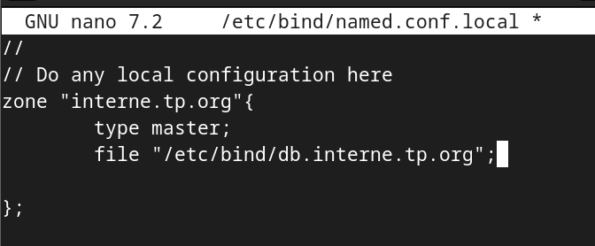***  
4. Créons le fichier de zone ***/etc/bind/db.interne.tp.org*** (C'est ici qu'on associe les noms aux IPs ) :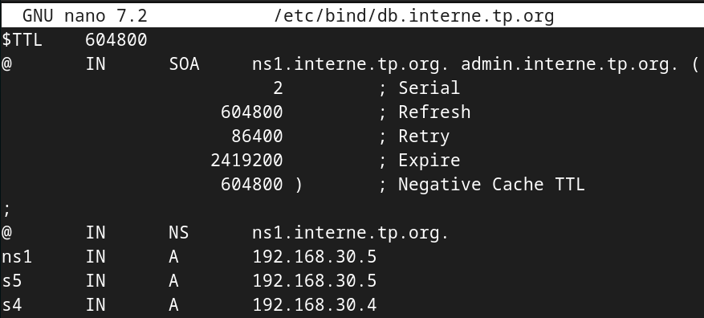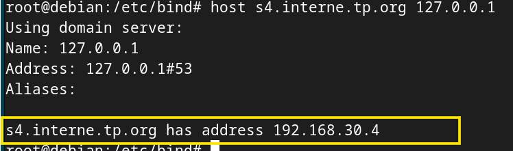
#
## **4.3	Étape 3 : Test de ssh de C1** {#Étape-3}
* **Test depuis C1 :** ***ssh debian[@s5.interne.tp.org](mailto:utilisateur@s5.interne.tp.org)***  
  * **Arrivez-vous à vous connecter ?** **Non \!**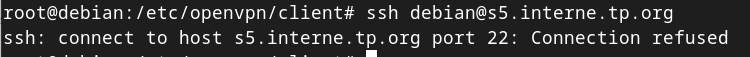
* **Pourquoi ?**    
  * C1 est configuré pour interroger **S3** (le DNS cache) pour la résolution de noms. Cependant, S3 ne gère pas la zone interne.tp.org (elle est sur S5 ). Et S3 ne sait pas qu'il doit interroger S5 pour cette zone précise. S3 va donc chercher interne.tp.org sur Internet, ne trouvera rien, et dira à C1 : "Ce nom n'existe pas". La connexion SSH échoue avant même que le moindre paquet ne soit envoyé vers S5  
* **Comment corriger ce problème ? (OpenVPN)**   
  * Il faut que, lorsque C1 se connecte au VPN, le serveur VPN (S4) dise à C1 : *"À partir de maintenant, n'utilise plus S3 comme serveur DNS, utilise le serveur DNS interne (S5) qui est accessible à travers le tunnel \!"*.  
  * La correction se fait donc en poussant l'adresse du serveur DNS interne via le tunnel VPN.  
* **La configuration (Sur S4) :**   
  * On ouvre le fichier ***/etc/openvpn/server/server.conf*** sur S4 et on ajoute la directive DHCP : ***push "dhcp-option DNS 192.168.30.5"***  
  * On redémarre le serveur OpenVPN sur S4: ***sudo systemctl start openvpn-server@server***  
  * Puis on Reconnecte le client C1: ***sudo openvpn \--config /etc/openvpn/client/client.conf***  
  * Puis on refait le ***ssh debian[@s5.interne.tp.org](mailto:utilisateur@s5.interne.tp.org)***  
  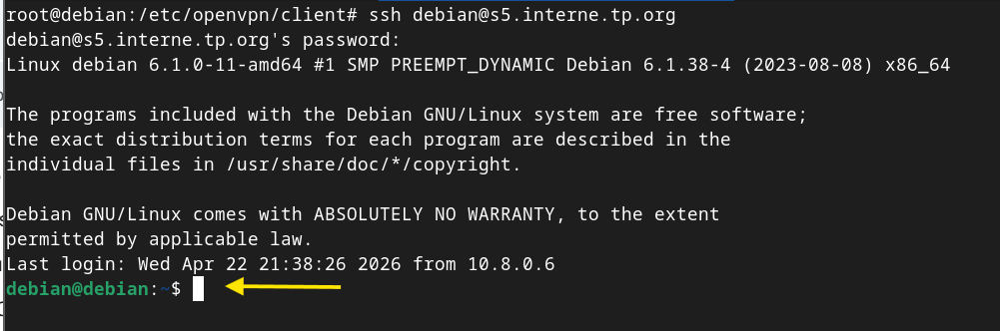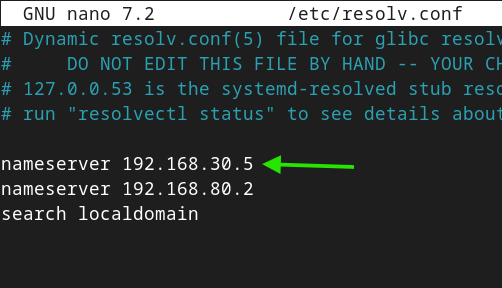
#
# **Configuration finale du serveur VPN (S4)**{#config-final-s4}

#
# **Test de résilience (Coupure de l'interface physique) :**  {#test-de-résilience}

* Lancement d'un ping continu depuis C1 vers le réseau distant.  
* Désactivation manuelle de l'interface physique du client (***sudo ip link set ens33 down***).  
* Réactivation de l'interface (***sudo ip link set ens33 up***).  
* **Observation** :  L'objectif de cette manipulation est d'observer si le service OpenVPN est capable de restaurer la connexion de manière autonome, sans nécessiter un redémarrage manuel du client. 
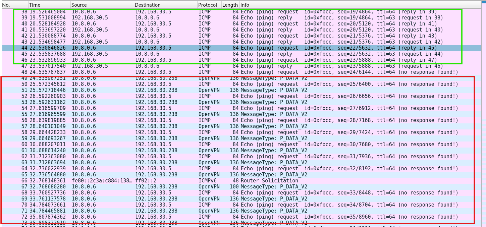
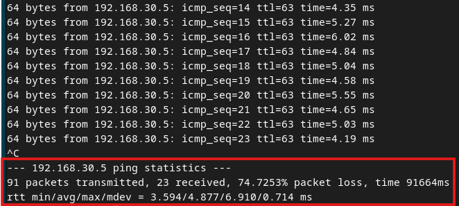

**Résultat et conclusion :** 

Contrairement aux attentes, le trafic ne reprend pas automatiquement après la réactivation de l'interface ens33. La connexion est définitivement interrompue et nécessite un redémarrage manuel du service OpenVPN sur le client. 

**Explication technique :** Ce comportement s'explique par la nature **"stateful" (avec état)** d'OpenVPN et son intégration avec le système d'exploitation :

1. **Perte de routage :** Lors de la désactivation de l'interface physique (ens33), le noyau Linux supprime instantanément toutes les routes associées à cette carte. L'architecture de routage d'OpenVPN s'effondre.  
2. **Rupture de la session TLS :** OpenVPN maintient une session cryptographique active avec le serveur. La coupure physique entraîne la perte des paquets de maintien en vie (keepalive). Le serveur et le client finissent par atteindre un délai d'attente (timeout) et considèrent la session TLS comme morte.  
3. **Absence de reconnexion dynamique (sans options spécifiques) :** Lorsque l'interface ens33 revient, OpenVPN ne détecte pas dynamiquement ce changement d'état matériel pour relancer son processus de poignée de main (handshake) à partir de zéro. Le processus devient "zombie", attendant sur une interface virtuelle tun0 dont les routes sous-jacentes sont obsolètes.

#
# **WireGuard** {#wireguard}

## **Architecture** {#architecture-1}
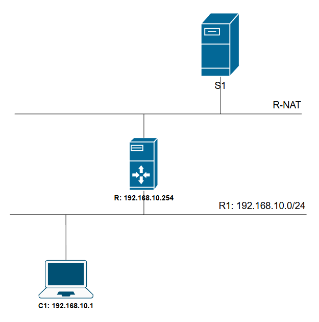

## **Q1**.  {#q1.}
***Combien de fichiers ont été nécessaires ? Comparez avec la PKI d’OpenVPN***

* **Nombre de fichiers nécessaires avec WireGuard**  
  * En exécutant la commande ***wg genkey | tee privatekey | wg pubkey \> publickey***, seulement **2 fichiers** ont été générés par machine :  
    * Une clé privée (privatekey)  
    * Une clé publique (publickey)

*(Soit un total de 4 fichiers pour établir un tunnel basique entre un client et un serveur).*

* **Comparaison avec la PKI d'OpenVPN**  
  * **L'approche WireGuard (Simple et décentralisée) :** WireGuard s'inspire de SSH. Il n'y a pas d'Autorité de Certification centrale. Le client et le serveur s'identifient simplement en s'échangeant mutuellement leurs clés publiques (courbe elliptique Curve25519). C'est ce qu'on appelle du *Crypto-Routing*.  
  * **L'approche OpenVPN (Lourde et centralisée) :** OpenVPN nécessite la mise en place d'une Infrastructure à Clés Publiques (PKI), souvent via l'outil easy-rsa. Pour que le tunnel fonctionne, on a dû manipuler au moins **7 fichiers différents**:  
    * Le certificat de l'autorité (***ca.crt***) présent des deux côtés.  
    * Les certificats publics signés (***serveur.crt, client.crt***).  
    * Les clés privées associées (***serveur.key, client.key***).  
    * Les paramètres Diffie-Hellman (***dh.pem***) pour l'échange sécurisé.  
    * La clé de signature HMAC (***ta.key***) pour se protéger des scans.

### **Configuration des machines:**{#config-machines} 
**C1 *(ip a et ip route***)
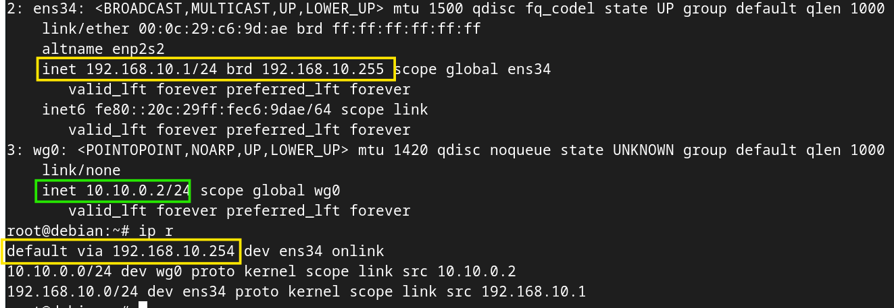
**C1** (config VPN ***/etc/wireguard/wg0.conf)***  
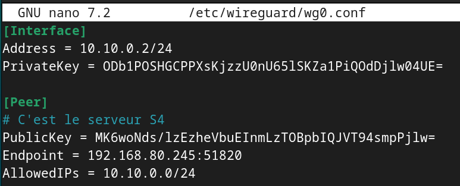
**S1** (***ip a et ip route***)  
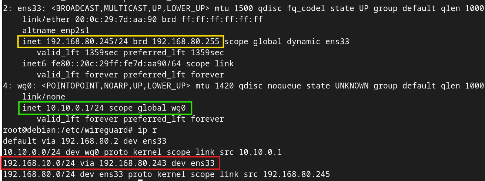
**S1** (config VPN  ***/etc/wireguard/wg0.conf***)  
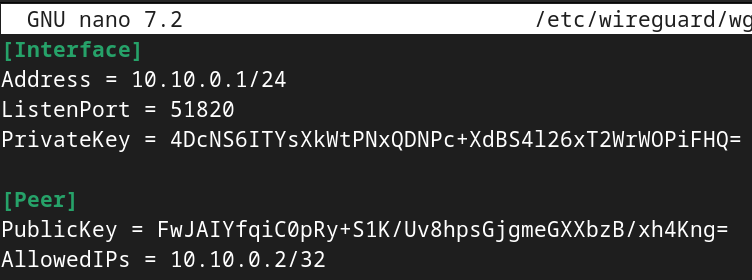Puis on démarre le tunnelle des deux côtés: **sudo wg-quick up wg0** 

### **Test de ping VPN:** {#test-de-ping-vpn:}
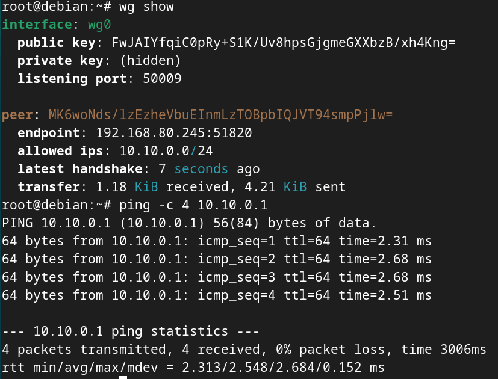
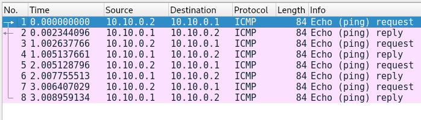
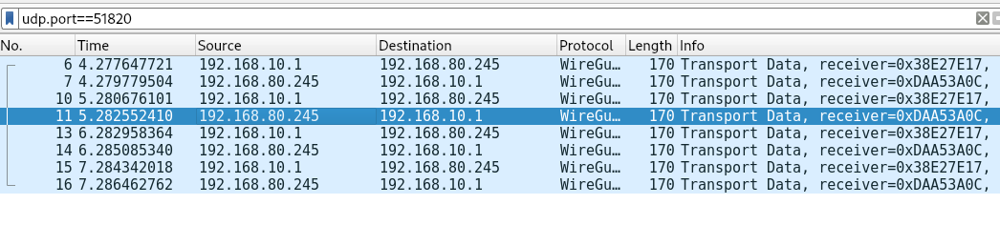
**Observation du trafic et principe d'encapsulation :** L'écoute simultanée des interfaces wg0 et ens33 met en évidence le mécanisme d'encapsulation et de chiffrement de WireGuard.

* Sur l'interface virtuelle **wg0**, nous observons le trafic "utile" en clair (les requêtes et réponses ICMP entre les adresses IP du tunnel 10.10.0.2 et 10.10.0.1).  
* Sur l'interface physique **ens33**, ce trafic ICMP n'est plus visible. Nous n'observons plus que des trames UDP (Port 51820\) circulant entre les adresses IP physiques des machines. Le paquet ICMP d'origine a été chiffré et encapsulé par WireGuard pour former le "Transport Data". Cela prouve que le tunnel sécurise efficacement les données et masque la nature du trafic interne vis-à-vis du réseau physique.

## **Q2**.{#q2}

***Modifiez AllowedIPs côté client à 0.0.0.0/0. Que se passe-t-il ? Quel est l’équivalent de la directive redirect-gateway d’OpenVPN ?***  

### **Redirection du trafic (AllowedIPs \= 0.0.0.0/0)**{#Redirection}
* **Que se passe-t-il ?** En modifiant AllowedIPs à 0.0.0.0/0 (qui représente l'intégralité de l'espace d'adressage IPv4), on indique à WireGuard d'acheminer **absolument tout le trafic sortant** de la machine client vers le tunnel VPN. L'outil ***wg-quick*** va automatiquement modifier la table de routage du client pour que la route par défaut pointe vers l'interface wg0.  
* **L'équivalent OpenVPN :** C'est l'équivalent direct de la directive **redirect-gateway def1** que nous avons étudiée dans la partie 3 du TP.

Et bien sûr on oublie la règle nat, pour masquer l’ip privée du vpn  
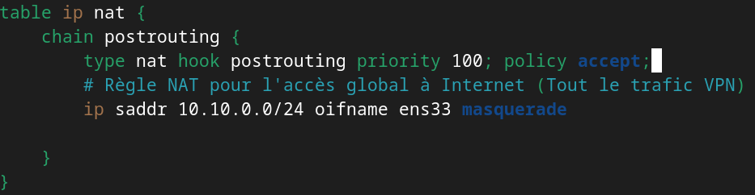

**Ping 8.8.8.8 depuis C1: interface ens33 de C1**

On voit bien que le trafic vers internet passe par le Wireguard  
**Table de routage C1**  
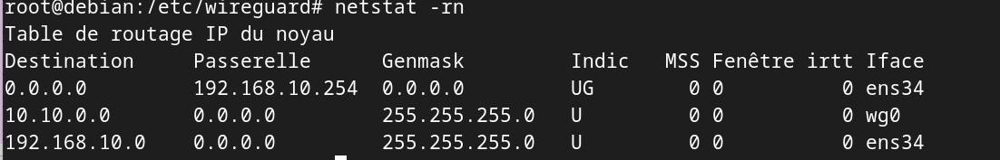
##

## **Q3.**{#q3}
***Désactivez l’interface physique du client (sudo ip link set ens33 down), puis réactivez-la. Le tunnel se rétablit-il automatiquement ? Comparez avec le comportement d’OpenVPN***  
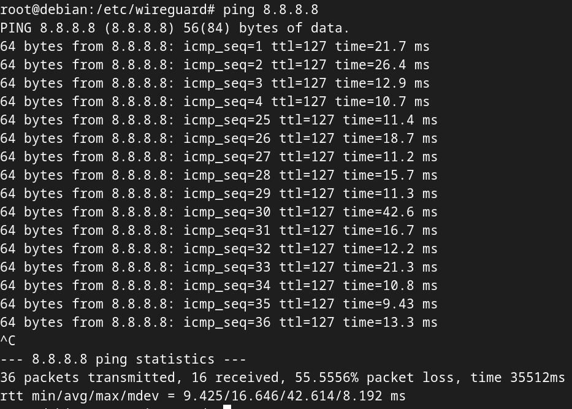
**Observation:** 

* On lance un vers 8.8.8.8 en contitue puis on désactive l’interface ens33 (***sudo ip link set ens33 down***): on remarque le ping est interrompus pas icmp reply  
* puis on réactive l’interface avec la commande ***systemctl restart networking***: on remarque que le ping reprend( icmp reply)

**Explication:**

### **Rétablissement du tunnel (Stateless vs Stateful)** {#rétablissement}

* **Le tunnel se rétablit-il automatiquement ?** **Oui, de manière instantanée et transparente.** Dès que l'interface physique ens33 remonte, les paquets recommencent à circuler comme si de rien n'était.  
* **Comparaison avec OpenVPN:**  
  * **WireGuard est "Stateless" (sans état) :** Il fonctionne exactement comme UDP (sur lequel il repose). Il n'y a pas de notion de "connexion" maintenue en permanence. Si l'interface physique coupe, WireGuard arrête juste d'envoyer des paquets. Quand elle revient, il reprend l'envoi. Le changement d'état réseau n'affecte pas le tunnel.  
  * **OpenVPN est "Stateful" (avec état) :** Il repose sur une session sécurisée TLS (comme le HTTPS). Si l'interface physique est coupée, les paquets sont perdus, le serveur et le client détectent un "timeout", et la session TLS s'effondre. Lorsque l'interface revient, OpenVPN doit recommencer à zéro : renégocier les clés, vérifier les certificats, et refaire un "handshake" complet, ce qui prend plusieurs secondes et coupe les connexions actives de l'utilisateur.

##

## **Q4.**  {#q4.}

***Depuis une machine non configurée comme peer, scannez le port 51820 du serveur avec nmap. Le serveur répond-il ? Expliquez le principe de stealth de WireGuard.***  
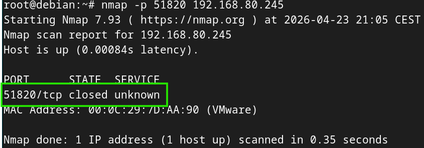
* **Le serveur répond-il au scan Nmap ?** **Non, il ne répond absolument rien.** Nmap affiche que le port 51820 est fermeé  
* **Le principe de Stealth de WireGuard :** WireGuard a été conçu pour être invisible aux attaquants. Lorsqu'il reçoit un paquet sur le port 51820, il vérifie immédiatement la signature cryptographique du paquet. Si le paquet ne provient pas d'un "Peer" explicitement configuré et connu (dont la clé publique est dans le fichier de configuration), **WireGuard rejette le paquet silencieusement (Drop)**. Il ne renvoie aucune erreur ICMP, aucun message de refus. Pour toute personne non authentifiée, le serveur semble tout simplement éteint ou inexistant sur ce port.
  
##

## **Q5.**{#q5}
***Comparez le temps de mise en place du tunnel WireGuard vs OpenVPN. Pourquoi WireGuard est-il plus rapide à établir la connexion ?***  
**Comparaison du temps :** La mise en place d'un tunnel WireGuard est quasi-instantanée (quelques millisecondes), contre plusieurs secondes pour OpenVPN.  
**Pourquoi WireGuard est-il plus rapide ?** Il y a deux raisons principales :
1. **Pas de PKI (Pas de certificats) :** OpenVPN doit vérifier la validité du certificat client, du certificat serveur, vérifier qu'ils sont signés par la bonne Autorité de Certification, puis négocier une suite de chiffrement. WireGuard saute toutes ces étapes : les clés publiques (Curve25519) sont déjà pré-échangées dans les fichiers de configuration.  
2. **Handshake en 1-RTT (Round Trip Time) :** La poignée de main cryptographique de WireGuard est extrêmement optimisée. Il suffit d'un seul aller-retour réseau pour que le client et le serveur soient d'accord sur la clé de session et commencent à transmettre des données utiles. L'échange TLS d'OpenVPN nécessite de multiples allers-retours avant que le premier paquet utile ne puisse passer.

#
# **Comparaison des  fichiers de configuration finaux  des serveurs:**{#Comparaison-serveur}
**OpenVPN:**  
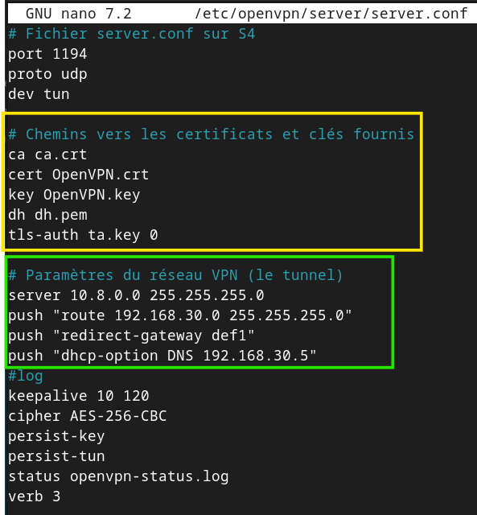
**Wireguard**  
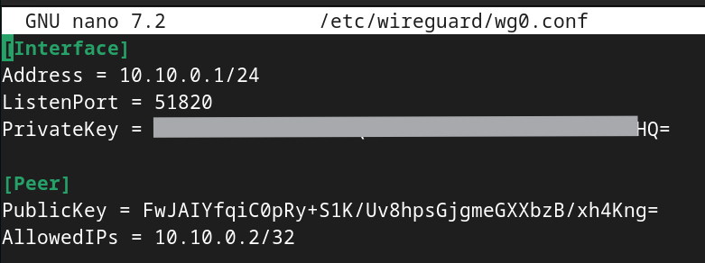

#
# **Conclusion**{#conclusion}
***Deux visions de la sécurité réseau :***

Ce projet nous a permis de construire et de sécuriser notre propre infrastructure réseau de bout en bout. Mais au-delà de la simple mise en place de tunnels, il nous a surtout offert un poste d'observation privilégié pour comparer deux philosophies de la sécurité informatique : la méthode classique et l'approche moderne.

**OpenVPN**, le colosse de l'industrie : Lors de sa configuration, nous avons pu constater la lourdeur et la rigueur qu'exige ce protocole historique. Pour établir la confiance, nous avons dû déployer une véritable bureaucratie numérique (la PKI), avec ses autorités de certification, ses clés privées et ses signatures complexes. De plus, sa gestion du trafic nécessite d'intervenir "manuellement" sur le système, en poussant des routes et en gérant des traductions d'adresses (NAT) de manière explicite. C'est une technologie robuste et hautement personnalisable, mais qui pardonne peu les erreurs de configuration.

**WireGuard**, la révolution par la simplicité : À l'inverse, le passage à WireGuard a été une révélation d'efficacité. Fini la bureaucratie des certificats : ici, tout repose sur un simple échange de deux clés (publique et privée), exactement comme pour un accès SSH. En quelques lignes de configuration, le tunnel était opérationnel. Nous avons également pu observer son incroyable furtivité (invisible aux scanners de ports) et sa capacité à rétablir la connexion instantanément après une coupure réseau, là où OpenVPN aurait dû tout renégocier péniblement.

***Le verdict de l'ingénieur :*** 

Aujourd'hui, OpenVPN reste indispensable car il est installé partout et s'adapte à tous les environnements d'entreprise (même les plus anciens). Cependant, WireGuard représente sans conteste l'avenir du VPN : en éliminant la complexité, il réduit les risques de failles humaines, offre des performances inégalées et rend l'administration réseau infiniment plus agréable. Ce TP démontre parfaitement qu'en informatique, la sécurité maximale se trouve souvent dans la simplicité absolue.

# 
# **Ressources** {#ressources}

**Configuration OpenVPN**

* Support de cours et TP  
* [https://doc.ubuntu-fr.org/openvpn](https://doc.ubuntu-fr.org/openvpn)  
* [https://wiki.debian.org/OpenVPN](https://wiki.debian.org/OpenVPN)

  
**Configuration Wireguard**

* Support de cours et TP  
* [https://www.wireguard.com/](https://www.wireguard.com/)  
* https://www.it-connect.fr/mise-en-place-de-wireguard-vpn-sur-debian-11/
